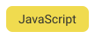
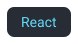

## Hello world 🌎 I'm Gustavo

I’m a full stack software developer MERN. I love experimenting with new tools and frameworks. I created solutions uning my development tools. I've experience with API Rest, API GraphQL, SocketIO, Single Page App, Server side render.

##### You can contact me by

### Development tools

### Proyects

One of my favorite projects is my personal blog, this project uses the MERN stack, has an api and a web client, it also applies different rendering techniques (ssr, csr, sr) and you can find it in this repository. [blogin-api](https://github.com/FrcGustavo/bloging-client), [bloging-client](https://github.com/FrcGustavo/bloging-api) and you can visit [here](https://frcgustavo.com)
